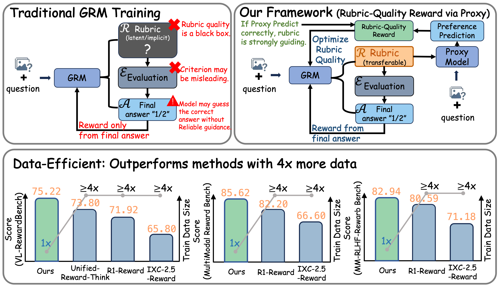
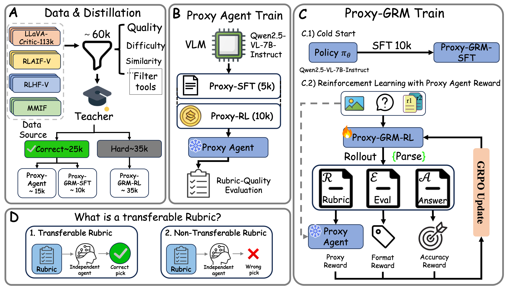

<div align="center">
<h1>Rationale Matters: Learning Transferable Rubrics via Proxy-Guided Critique for VLM Reward Models</h1>


<!-- Badges -->
<a></a> 
<a href="https://arxiv.org/abs/2603.16600"></a> 
<a href="https://github.com/Qwen-Applications/Proxy-GRM"></a> 
<a href="https://opensource.org/licenses/Apache-2.0"></a>


<p align="center">
  <i><b>  Qwen Large Model Application Team, Alibaba</b></i>
</p>

<p align="center">
  
</p>
<p align="center">
  <b>Figure 1.</b> Teaser Figure: Rationale Matters: Learning Transferable Rubrics via Proxy-Guided Critique for VLM Reward Models.
</p>


<p align="center">
  
</p>
<p align="center">
  <b>Figure 2.</b> Overview of the Proxy-GRM framework, Training data distillation, Proxy model training and Proxy-GRM training.
</p>

</div>

## ⚙️ 1. Setup and Training
### Dataset Preparation
Download the following datasets: [LLava-Critic-113k](https://huggingface.co/datasets/lmms-lab/llava-critic-113k), [RLAIF-V](https://huggingface.co/datasets/openbmb/RLAIF-V-Dataset), [RLHF-V](https://huggingface.co/datasets/llamafactory/RLHF-V) and  [MMIF-23K](https://huggingface.co/datasets/ChrisDing1105/MMIF-23k). Then, distill all datasets using the Qwen3-VL-235B-A22B-Instruct model with the following prompt.


### For SFT Stage
We use the [**ms-swift**](https://swift.readthedocs.io/en/latest/GetStarted/Quick-start.html) training framework for the SFT stage; therefore, the training datasets shoule be converted to the [**ms-swift multimodal**](https://swift.readthedocs.io/en/latest/Customization/Custom-dataset.html#multimodal) data format.
#### Environment
```bash
pip install -r requirements_sft.txt
```
#### Training
```bash
cd Proxy-GRM/scripts/sft

# swanlab
export swanlab_token='Your swanlab api key.'
export swanlab_project='Your swanlab project name.'
export swanlab_mode='Your swanlab mode.'
export SWANLAB_LOG_DIR='Your swanlab local log dir.'

export MASTER_PORT=

export gpus=0,1,2,3
IFS=',' read -ra gpu_array <<< "$gpus"

export gpu_count=${#gpu_array[@]}

export data_path='Path to your training file.'
export model_path='Path to your training model.'

export freeze_vit=false
export freeze_llm=false
export freeze_aligner=false

export swanlab_exp_name='Your swanlab experiment name.'

export output_path='Your saved model path.'

bash train_scripts.sh
```

### For RL Stage
We use the **Verl** training framework for the RL stage; therefore, the training datasets shoule be converted to the parquet data format.
#### Environment
```bash
conda create -n verl_env python=3.12 -y
conda activate verl_env

cd Proxy-GRM/verl
USE_MEGATRON=0 bash scripts/install_vllm_sglang_mcore.sh

pip install --no-deps -e .
```
#### RL training

##### Start the proxy model
After launching the proxy model, add its **IP address** and **port** to the **RL training script**.
```bash 
# 1. get ip address of the proxy model
hostname -I

# 2. start
cd Proxy-GRM/proxy
python proxy.py --port port --model_id model_id
```

##### VERL training
Set the ip address and port of the proxy model in the script below.
```bash
cd Proxy-GRM/scripts/rl
export train_file='Path to your training file.'
export test_file='Path to your testing file.'

export model_path='Path to your training model'
# for swanlab
export project_name='Your swanlab project name.'
export experiment_name='Your swanlab experiment name.'
export SWANLAB_MODE='Your swanlab mode.'
export SWANLAB_API_KEY='Your swanlab api key.'
export SWANLAB_LOG_DIR='Your swanlab local log dir'

export save_path='Path to your saved model.'

export REWARD_PATH=Proxy-GRM/verl/verl/utils/reward_score/grm_reward_with_instruct.py
export REWARD_FUNC_NAME=compute_score
export epochs=1
# for proxy model
export ip='IP address of the proxy model.'
export api_port='Port of the proxy model.'
export use_api='1'
export use_format='1'
export gpus=0,1,2,3,4,5,6,7

export batch_size=128

bash scripts.sh
```


## 🚀 Evaluation
Download the following evluation datasets: [VL-RewardBench](https://huggingface.co/datasets/MMInstruction/VL-RewardBench), [Multimodal RewardBench](https://huggingface.co/datasets/syhuggingface/multimodal_rewardbench) and [MM-RLHF-RewardBench](https://huggingface.co/datasets/yifanzhang114/MM-RLHF-RewardBench). Then, prepare all evaluation data in a **JSONL** file using the following format.
```json
{"id": "LRVInstruction-000000007746", "prompt": "The dog has one floppy ear and one straight ear.", "chosen": "There is no existence of the dog's ear shape in the image description.", "rejected": "The dog is brown, white, and black in color with a blue background on its face. It lies down next to the mirror, looking at itself from above or below it. Its ears are both floppy and straight.", "image": "Path to LRVInstruction-000000007746 image file", "chosen_reason": "", "rejected_reason": ""}
```
### Evaluation on VL-RewardBench
```bash
cd Proxy-GRM/eval
# step 1: generate the evaluation result jsonl
python vl_reward_bench.py --model-path your_model_path --question_file path_to_the_vl_rewardbench_evalution_jsonl_file --answers_file path_to_the_saved_jsonl_file

# step 2: calculate the evaluation metric
python get_acc_vl_reward_bench.py --file_path path_to_the_saved_jsonl_file
```

### Evaluation on Multimodal RewardBench
```bash
cd Proxy-GRM/eval
# step 1: generate the evaluation result jsonl
python multimodal_reward_bench.py --model-path your_model_path --question_file path_to_the_multimodal_rewad_bench_evalution_jsonl_file --answers_file path_to_the_saved_jsonl_file

# step 2: calculate the evaluation metric
python get_acc_multimodal_reward_bench.py --file_path path_to_the_saved_jsonl_file
```

### Evaluation on MM-RLHF-RewardBench
```bash
cd Proxy-GRM/eval
# step 1: generate the evaluation result jsonl
python mmrlhf_reward_bench.py --model-path your_model_path --question_file path_to_the_mm_rlhf_rewardbench_evalution_jsonl_file --answers_file path_to_the_saved_jsonl_file

# step 2: calculate the evaluation metric
python get_acc_mmrlhf_reward_bench.py --file_path path_to_the_saved_jsonl_file
```


## 📁 Repository Structure

```
Proxy-GRM/
├── README.md
├── requirements_sft.txt
├── verl/                                   # verl framework
├── eval/
│   ├── vl_reward_bench.py                  # VL-RewardBench Evaluation
│   ├── get_acc_vl_reward_bench.py          # get accuracy of VL-RewardBench Evaluation
│   │
│   ├── multimodal_reward_bench.py          # MultiModal-Reward Bench Evaluation
│   ├── get_acc_multimodal_reward_bench.py  # get accuracy of  MultiModal-Reward Bench Evaluation
│   │
│   ├── mmrlhf_reward_bench.py              # MM-RLHF-Reward Bench Evaluation
│   ├── get_acc_vl_reward_bench.py          # get accuracy of MM-RLHF-Reward Bench Evaluation
│   │
│
└── proxy/
    ├── proxy.py                            # proxy model
```

## 🙏 Acknowledgements

We build on and thank the open-source communities behind QwenVL, verl, vLLM, and the benchmark datasets (VL-RewardBench, Multimodal RewardBench and MM-RLHF-RewardeBench).

## 📜 Citation

If you find our work useful, please consider citing:

```bibtex
@misc{qiu2026rationalematterslearningtransferable,
      title={Rationale Matters: Learning Transferable Rubrics via Proxy-Guided Critique for VLM Reward Models}, 
      author={Weijie Qiu and Dai Guan and Junxin Wang and Zhihang Li and Yongbo Gai and Mengyu Zhou and Erchao Zhao and Xiaoxi Jiang and Guanjun Jiang},
      year={2026},
      eprint={2603.16600},
      archivePrefix={arXiv},
      primaryClass={cs.CV},
      url={https://arxiv.org/abs/2603.16600}, 
}
```
